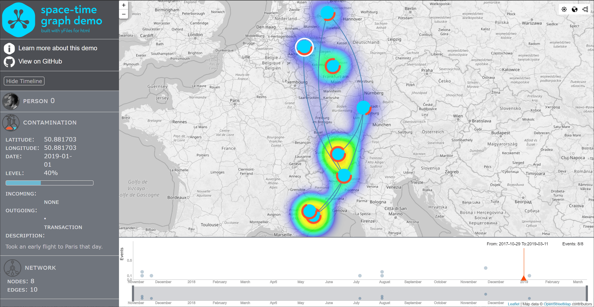

# Navigating Your Graph Through Time and Space



This repository contains the sample application for the yFiles use case about
[Navigating Your Graph Through Time and Space](https://www.yworks.com/use-case/navigating-your-graph-through-space-and-time).
The app combines the presentation of geographical, temporal and relational data.
It shows how time windows can filter out diagrams and how geographical mapping of diagrams helps discovery.

## See also

- [Watch the introductory video](https://www.youtube.com/channel/UC6GqOEPI6Xrhy4ylDKHP0Aw) of this app
- [Try the app online](https://live.yworks.com/demos/use-case/space-time-graphs)
- [Read the article](https://www.yworks.com/use-case/navigating-your-graph-through-space-and-time) about _Navigating Your Graph Through Space and Time_
- [Learn more about yFiles](https://www.yworks.com/products/yfiles), the software library for visualizing, editing, and analyzing graphs

If you have any questions or suggestions, send us an email at [consulting@yworks.com](mailto:consulting@yworks.com)
or call [+49 7071 9709050](tel:+4970719709050).

## How to run this app

You need a copy of the [yFiles for HTML](https://www.yworks.com/products/yfiles-for-html) diagramming library in order
to run this application. You can download a free test version of yFiles in the
[yWorks Customer Center](https://my.yworks.com/signup?product=YFILES_HTML_EVAL).

Checkout this project, then extract the yFiles for HTML package to a directory next to it, e.g.:

```
documents
 |-- space-time-graphs
 |-- yFiles-for-HTML-Complete-2.4.0.5-Evaluation
```

Afterwards, enter the `space-time-graphs` directory and run the usual commands

```
npm i
```

followed by

```
npm start
```

## Some notes on the implementation

The application is based on Angular CLI with reusable components for your convenience. However, one could just as well have based things on React or Vue or similar single-page app frameworks: our choice does not convey in any way some particular conviction. In fact, we support all of those and have both documentation and examples illustrating the way you can integrate yFiles into applications using any of these frameworks.

In order to keep the app easy to use and explore, we made some choices:

- there is no graph store or REST service as backend serving data. Instead, you will find a straightforward JSON file representing the graph structure and the presented data in general. You can adapt this JSON or add a webservice according to your needs and context.
- the components consume data via a [Redux store](https://ngrx.io/) in order to have a 'reactive' setup. There are many ways one can implement inter-component communication, and, here again, we picked Redux without advocating preference.
- we used TypeScript, but you can assemble things just as well with plain JavaScript.

Of course, much can be said about the actual implementation and the inevitable glitches. Feel free to give your feedback via [Github](https://github.com/yWorks/space-time-graphs) or [tweet us](https://twitter.com/yworks)!

### The yFiles diagramming library

This application is powered by [yFiles for HTML](https://www.yworks.com/products/yfiles-for-html), the powerful
diagramming library.

Turn your data into clear diagrams with the help of unequaled automatic diagram layout, use rich visualizations for your
diagram elements, and give your users an intuitive interface for smooth interaction.

You can learn more about the many features that come with yFiles
on the [yFiles Features Overview](https://www.yworks.com/products/yfiles/features).

If you want to try it for yourself, obtain a free test version of yFiles in the
[yWorks Customer Center](https://my.yworks.com/signup?product=YFILES_HTML_EVAL).

## Contact

If you have any questions or suggestions, send us an email at [consulting@yworks.com](mailto:consulting@yworks.com)
or call [+49 7071 9709050](tel:+4970719709050).

## Data

All data is fictitious and any correspondence is accidental.
The used faces are from [http://uifaces.com](http://uifaces.com) and are free to use for any purpose.

## License

The MIT License (MIT)

Copyright (c) 2022 yWorks GmbH

Permission is hereby granted, free of charge, to any person obtaining a copy of this software and associated documentation files (the "Software"), to deal in the Software without restriction, including without limitation the rights to use, copy, modify, merge, publish, distribute, sublicense, and/or sell copies of the Software, and to permit persons to whom the Software is furnished to do so, subject to the following conditions:

The above copyright notice and this permission notice shall be included in all copies or substantial portions of the Software.

THE SOFTWARE IS PROVIDED "AS IS", WITHOUT WARRANTY OF ANY KIND, EXPRESS OR IMPLIED, INCLUDING BUT NOT LIMITED TO THE WARRANTIES OF MERCHANTABILITY, FITNESS FOR A PARTICULAR PURPOSE AND NONINFRINGEMENT. IN NO EVENT SHALL THE AUTHORS OR COPYRIGHT HOLDERS BE LIABLE FOR ANY CLAIM, DAMAGES OR OTHER LIABILITY, WHETHER IN AN ACTION OF CONTRACT, TORT OR OTHERWISE, ARISING FROM, OUT OF OR IN CONNECTION WITH THE SOFTWARE OR THE USE OR OTHER DEALINGS IN THE SOFTWARE.
