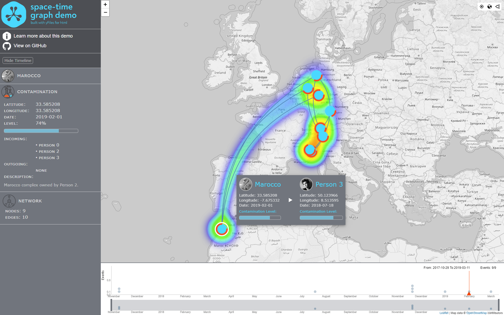

# Navigating your graph through time and space

How time windows filter out diagrams and how geographic mapping of diagrams can help discovery.

## Install

Copy the content of a yFiles for HTML 2.2 package into `./yFiles/` as well as the `license.json`
of your yFiles package into `./Client/src/assets/`.

Then, run 

    yarn
    
or 

    npm i
    
within the `Client` directories. Once the packages are installed use

    yarn start
    
the app will be at port 4001. You can also explicitly use something like

    ng serve --open --port 4001
        
## About

This application is powered by [yFiles for HTML](https://www.yworks.com/products/yfiles-for-html), the powerful 
diagramming library.

Turn your data into clear diagrams with the help of unequaled automatic diagram layout, use rich visualizations for your 
diagram elements, and give your users an intuitive interface for smooth interaction.

You can learn more about the many features that come with [yFiles](https://www.yworks.com/products/yfiles)
on the [yFiles Features Overview](https://www.yworks.com/products/yfiles/features).

If you want to try it for yourself, you can obtain a free evaluation version of yFiles in the 
[yWorks Evaluation Center](https://my.yworks.com/signup?product=YFILES_HTML_EVAL).
 

## Data

All data is fictitious and any correspondence is accidental. The faces used are from [http://uifaces.com](http://uifaces.com) and are free to use for any purpose.

## Dependencies
* [angular](https://github.com/angular/angular)
* [ngrx/effects](https://github.com/ngrx/effects)
* [ngrx/store](https://github.com/ngrx/platform)
* [bootstrap](https://github.com/twbs/bootstrap)
* [core-js](https://github.com/zloirock/core-js)
* [D3.js](https://github.com/d3/d3)
* [faker](https://github.com/Marak/Faker.js)
* [jquery](https://github.com/jquery/jquery)
* [leaflet](https://github.com/Leaflet/Leaflet)
* [leaflet-draw](https://github.com/Leaflet/Leaflet.draw)
* [lodash](https://github.com/lodash/lodash)
* [moment](https://github.com/moment/moment)
* [rxjs](https://github.com/reactivex/rxjs)
* [whatwg-fetch](https://github.com/github/fetch)
* [zone.js](https://github.com/angular/zone.js)

## License
The MIT License (MIT)

Copyright (c) 2015-2019 yWorks GmbH

Permission is hereby granted, free of charge, to any person obtaining a copy of this software and associated documentation files (the "Software"), to deal in the Software without restriction, including without limitation the rights to use, copy, modify, merge, publish, distribute, sublicense, and/or sell copies of the Software, and to permit persons to whom the Software is furnished to do so, subject to the following conditions:

The above copyright notice and this permission notice shall be included in all copies or substantial portions of the Software.

THE SOFTWARE IS PROVIDED "AS IS", WITHOUT WARRANTY OF ANY KIND, EXPRESS OR IMPLIED, INCLUDING BUT NOT LIMITED TO THE WARRANTIES OF MERCHANTABILITY, FITNESS FOR A PARTICULAR PURPOSE AND NONINFRINGEMENT. IN NO EVENT SHALL THE AUTHORS OR COPYRIGHT HOLDERS BE LIABLE FOR ANY CLAIM, DAMAGES OR OTHER LIABILITY, WHETHER IN AN ACTION OF CONTRACT, TORT OR OTHERWISE, ARISING FROM, OUT OF OR IN CONNECTION WITH THE SOFTWARE OR THE USE OR OTHER DEALINGS IN THE SOFTWARE.